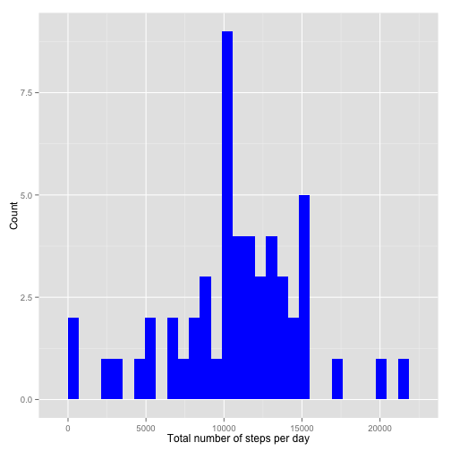
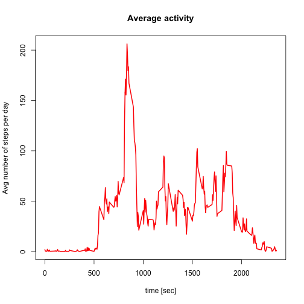
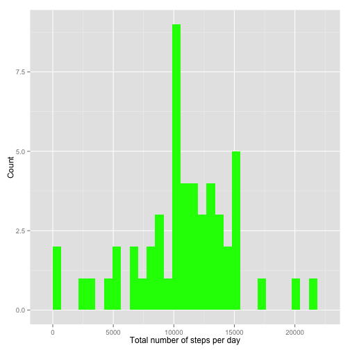
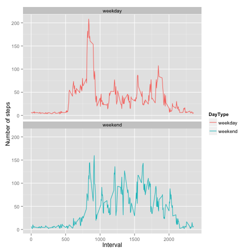

```
## 
## Attaching package: 'dplyr'
## 
## The following objects are masked from 'package:stats':
## 
##     filter, lag
## 
## The following objects are masked from 'package:base':
## 
##     intersect, setdiff, setequal, union
```

#Loading and preprocessing the data


```r
SrcFilename<-"repdata-data-activity.zip"
if (!file.exists(SrcFilename)){
  #  quit(save = "ask", status = 0,
  #       runLast = TRUE)
  print (paste("file ",SrcFilename,"File not found"))
}
```

```
## [1] "file  repdata-data-activity.zip File not found"
```

```r
unzip(SrcFilename)
```

```
## Warning in unzip(SrcFilename): error 1 in extracting from zip file
```

```r
ActivityData<-read.csv("activity.csv",header=TRUE,sep=",")
```

#What is mean total number of steps taken per day


```r
SumDataActivity<-aggregate(steps~date,ActivityData,sum)
```

1.) Plot the histogram of the total number of steps taken each day.


```r
p<- ggplot(SumDataActivity,aes(x = steps))+ 
  geom_histogram(fill="blue") +
  labs(x="Total number of steps per day", y = "Count")
print(p)
```

```
## stat_bin: binwidth defaulted to range/30. Use 'binwidth = x' to adjust this.
```

 

2.) Mean and median of the number of steps

```r
MeanVal<-mean(SumDataActivity[,2])
MedianVal<-median(SumDataActivity[,2])
print(MeanVal)
```

```
## [1] 10766.19
```

```r
print(MedianVal)
```

```
## [1] 10765
```

#What is the average daily activity pattern?


```r
AvgDailyIntervalPat<-aggregate(steps~interval,ActivityData,mean)
with(AvgDailyIntervalPat,{ 
  plot(interval,steps,type="l",xlab="time interval [sec]",ylab="Avg number of steps",lwd="2",main="Average activity",col="red") 
})
```

 

- Get the interval with max number of steps over all days


```r
indx<-which.max(AvgDailyIntervalPat[,2])
Intervalbegin<-AvgDailyIntervalPat[indx,1]
Intervalend<-Intervalbegin+5
print(paste("Interval of max mean steps:",Intervalbegin,"-",Intervalend))
```

```
## [1] "Interval of max mean steps: 835 - 840"
```

#Imputing missing values
- Count Number of rows with NA


```r
NumCompCases<-sum(complete.cases(ActivityData))
NumNas<-sum(!complete.cases(ActivityData))
print(paste("Number of rows with NAs:",NumNas))
```

```
## [1] "Number of rows with NAs: 2304"
```

- Fill in the NAs
The strategy that I will use is to take replace the NAs by the mean for that day.
The new data set is called ActivityFullData.


```r
MeanByDay<-aggregate(steps~date,ActivityData,mean)
ActivityFullData<-transform(ActivityData,steps=ifelse(is.na(steps),
              MeanByDay[as.Date(MeanByDay$date)%in%as.Date(ActivityData$date),2],steps))
```

- Make a new histogram  of the total number of steps taken each day

```r
SumDataActivityFull<-aggregate(steps~date,ActivityData,sum)
p1<- ggplot(SumDataActivityFull,aes(x = steps))+ 
  geom_histogram(fill="green") +
  labs(x="Total number of steps per day", y = "Count")
print(p1)
```

```
## stat_bin: binwidth defaulted to range/30. Use 'binwidth = x' to adjust this.
```

 

2.)New Mean and median of the number of steps


```r
MeanValNew<-mean(SumDataActivityFull[,2])
MedianValNew<-median(SumDataActivityFull[,2])
print(MeanValNew)
```

```
## [1] 10766.19
```

```r
print(MedianValNew)
```

```
## [1] 10765
```

The mean and median values are not affected by imputing the NAs with 
means over that corresponding day.

#Are there differences in activity patterns between weekdays and weekends?
- First create the grouped data and the factors weekends and weekdays


```r
ActivityFullData<-mutate(ActivityFullData,weekdays(as.Date(date)))
names(ActivityFullData)[4]<-c("DayType")
ActivityFullData<-transform(ActivityFullData,DayType=ifelse(DayType %in% c("Saturday","Sunday"),"weekend","weekday"))
ActivityFullData$DayType<-as.factor(ActivityFullData$DayType)
```

#Are there differences in activity patterns between weekdays and weekends?


```r
AvgFullData<-aggregate(steps~interval+DayType,ActivityFullData,mean)
p3<-ggplot(AvgFullData,aes(interval,steps,color=DayType)) +
  geom_line() +
  labs(x="Interval", y = "Number of steps") +
  facet_wrap(~DayType,nrow=2)
print(p3)
```

 

